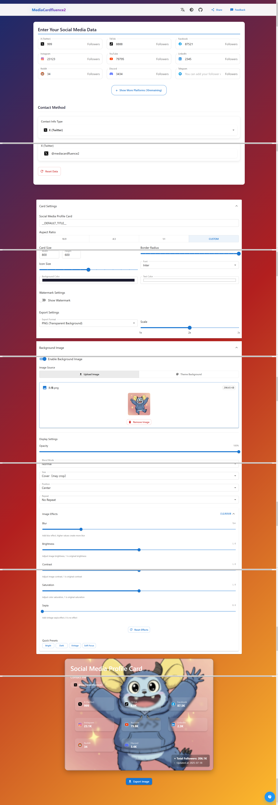
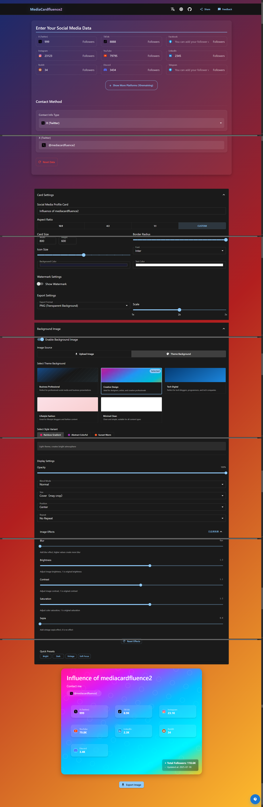

# 📊 MediaCardfluence | Professional Social Media Data Card Generator

> 🚀 **Create stunning social media showcase cards in seconds** | Multi-platform data integration | Custom styling | One-click export | Essential tool for content creators

## 🌍 Languages | 语言 | 言語
- [🇺🇸 **English**](#english-version) ⬇️
- [🇨🇳 **中文**](#中文版本) ⬇️
- [🇯🇵 **日本語**](#日本語版) ⬇️

---

# 🇺🇸 English Version

## ✨ What is MediaCardfluence?

**MediaCardfluence** is a powerful, free web-based tool designed for content creators, influencers, and social media professionals to create beautiful, professional data showcase cards. Transform your scattered follower statistics into stunning visual presentations perfect for brand collaborations, portfolio showcases, and social media sharing.

### 🎯 Perfect for:
- 👑 **Content Creators & Influencers** - Showcase your multi-platform reach
- 🤝 **Brand Collaboration** - Professional data presentation for partnerships  
- 📈 **Social Media Managers** - Create standardized reports
- 🎨 **Portfolio Building** - Visual representation of your digital influence
- 📊 **Marketing Agencies** - Client performance showcases

## 🚀 Key Features

### 📱 **20+ Platform Support**
Integrate data from all major social media platforms worldwide:

**🌍 Global Platforms:**
- 🐦 **X (Twitter)** - 450M+ users worldwide for real-time conversations
- 📸 **Instagram** - 2B+ users sharing photos, videos, and stories
- ▶️ **YouTube** - 2.7B+ users, world's largest video platform
- 📘 **Facebook** - 3B+ users, global social networking giant
- 🎵 **TikTok** - 1B+ users enjoying short-form video content
- 💼 **LinkedIn** - 900M+ professionals networking globally
- 🗨️ **Reddit** - 430M+ users in diverse forum communities
- 🎮 **Discord** - 150M+ users in gaming and community servers
- ✈️ **Telegram** - 800M+ users for secure messaging
- 👻 **Snapchat** - 750M+ users sharing multimedia messages

**🇨🇳 Chinese Platforms:**
- 💬 **WeChat (微信公众号)** - 1.3B+ users, China's super app ecosystem
- 📱 **Douyin (抖音)** - 600M+ daily users on China's leading short video platform
- 🛍️ **Xiaohongshu (小红书)** - 300M+ users for lifestyle and shopping discovery
- 📺 **Weibo (微博)** - 580M+ users on China's Twitter-like platform
- 🎬 **Bilibili (B站)** - 330M+ users in video sharing and ACG community
- 📹 **Video Account (视频号)** - WeChat's integrated video platform
- 🏃 **Kuaishou (快手)** - 380M+ users documenting real life moments
- 💡 **Zhihu (知乎)** - 100M+ users in China's premier Q&A community
- 💻 **Juejin (掘金)** - Leading Chinese developer community platform

### 🎨 **Advanced Customization**
- 🎯 **Custom Card Titles** - Personalize your brand message
- 🌈 **Color Schemes** - Match your brand colors perfectly
- 📐 **Flexible Sizing** - Multiple aspect ratios (16:9, 4:3, 1:1, custom)
- 🔤 **Typography Control** - Multiple font families and sizes
- 🖼️ **Background Options** - Solid colors, gradients, or custom images
- 💧 **Watermark Support** - Add your brand watermark
- 📱 **Responsive Design** - Perfect on desktop and mobile

### 💾 **Smart Data Management**
- 🔒 **100% Privacy** - All data stored locally in your browser
- 💪 **No Registration** - Start creating immediately
- 🗜️ **Data Compression** - Optimized storage with smart compression
- 🔄 **Auto-Save** - Never lose your work
- 📱 **Cross-Device** - Access from any device with your data

### 📤 **Professional Export**
- 🖼️ **High-Quality Images** - PNG/JPEG formats up to 4K resolution
- ⚡ **One-Click Export** - Download instantly
- 📏 **Custom Scaling** - Adjust resolution for different use cases
- 🎨 **Perfect for Social** - Optimized for all platform requirements

## 🎬 How to Use

### Step 1: 📊 Enter Your Data
1. Visit [MediaCardfluence](https://mediacardfluence2.onrender.com/)
2. Fill in your follower counts for each platform
3. Add your contact information (WeChat ID, Email)
4. Watch the card update in real-time

### Step 2: 🎨 Customize Your Card
1. Click **"Style Settings"** to open customization panel
2. Adjust colors, fonts, and sizing
3. Upload background images if desired
4. Add watermarks for branding
5. Preview changes instantly

### Step 3: 📤 Export & Share
1. Click **"Export Image"** button
2. Choose format (PNG for transparency, JPEG for smaller files)
3. Select quality and scale
4. Download your professional card
5. Share on social media or use in presentations

## 🛠️ Technical Features

- ⚡ **Lightning Fast** - Optimized React 18 performance
- 📱 **Responsive Design** - Perfect on all devices
- 🌐 **PWA Ready** - Install as an app
- 🔒 **Secure** - No data transmission to servers
- 🌍 **Multi-language** - English & Chinese support
- ♿ **Accessible** - WCAG compliant interface

## 🎉 Success Stories & Use Cases

### 🌟 **Real Creator Success**
> *"MediaCardfluence helped me land 3 brand deals in my first month! The professional cards made all the difference in my pitch emails."*  
> **- Sarah Kim, Lifestyle Influencer (245K followers across platforms)**

> *"As a marketing agency, we save 5+ hours per week creating client reports. The standardized format impresses our clients every time."*  
> **- Digital Marketing Pro Agency**

### 📊 **Comparison: Before vs After MediaCardfluence**

| Traditional Method | 🆚 | MediaCardfluence |
|-------------------|------|-----------------|
| ❌ Excel spreadsheets | | ✅ Beautiful visual cards |
| ❌ 2-3 hours per card | | ✅ 2-3 minutes per card |
| ❌ Platform inconsistency | | ✅ Professional standardization |
| ❌ Manual updates | | ✅ Quick data entry |
| ❌ Poor visual impact | | ✅ Instagram-worthy designs |

### 🎯 **Perfect Use Cases**
- 📧 **Email Signatures** - Stand out in professional communications
- 📱 **Social Media Bios** - Link to your data card instead of listing numbers
- 🤝 **Pitch Decks** - Impress brands with professional presentation
- 📄 **Media Kits** - Essential component for influencer portfolios
- 📈 **Progress Reports** - Show growth to your audience
- 🎨 **Portfolio Websites** - Embed stunning data visualizations

## 💡 Pro Tips

### 🎯 For Content Creators:
- 📅 **Monthly Updates** - Keep cards current for brand collaborations
- 🎨 **Brand Consistency** - Use consistent color schemes across all materials
- 📞 **Contact Ready** - Always include professional contact information
- 📱 **Multiple Formats** - Export high-res for media kits, compressed for social media
- 📈 **Growth Tracking** - Create monthly versions to show progression

### 🤝 For Brand Collaborations:
- 📊 **Data Storytelling** - Highlight your strongest performing platforms
- 🎯 **Niche Focus** - Emphasize platforms relevant to the brand's audience
- 💼 **Professional Colors** - Use sophisticated color schemes
- 📧 **Email Ready** - Perfect size for email attachments
- 🔗 **QR Codes** - Add QR codes linking to your full portfolio

### 📈 For Agencies:
- 🏷️ **Template Library** - Create industry-specific templates
- 🌟 **White Labeling** - Use client logos as watermarks
- 📋 **Standardization** - Maintain consistent reporting formats
- 🚀 **Efficiency** - Batch create cards for multiple clients
- 📊 **Client Presentations** - Impressive visuals for client meetings

## ❓ Frequently Asked Questions

### 🔒 **Is my data safe?**
Absolutely! All data is stored locally in your browser. We never collect, store, or transmit your information to any servers.

### 💰 **Is MediaCardfluence really free?**
Yes, completely free with no hidden costs, subscriptions, or premium features. We believe great tools should be accessible to all creators.

### 📱 **Can I use it on mobile?**
Perfect mobile experience! Create and edit cards on any device - desktop, tablet, or smartphone.

### 🌍 **What languages are supported?**
Currently supporting English and Chinese (中文), with more languages coming soon based on user requests.

### 📊 **How accurate should my follower numbers be?**
Use your most recent, accurate numbers. Brands appreciate authenticity over inflated statistics.

### 🎨 **Can I customize the design completely?**
Extensive customization options including colors, fonts, sizes, backgrounds, and watermarks. More design templates coming soon!

### 📤 **What export formats are available?**
PNG (best for social media, transparency support) and JPEG (smaller file size, perfect for emails).

### 🔄 **How often should I update my cards?**
We recommend monthly updates, or whenever you hit significant follower milestones.

## 🔍 SEO Keywords & Tags
`social media card generator`, `influencer portfolio tool`, `content creator toolkit`, `brand collaboration tool`, `social media statistics`, `follower count display`, `multi-platform analytics`, `social media dashboard`, `influencer marketing`, `content creator resources`, `social media tools`, `digital marketing`, `brand partnership`, `social media portfolio`, `instagram analytics`, `tiktok creator tools`, `youtube creator dashboard`, `twitter analytics`, `social media manager`, `influencer outreach`, `creator economy tools`, `social media reporting`, `free social media tools`, `professional social cards`

---

# 🇨🇳 中文版本

## ✨ MediaCardfluence 是什么？

**MediaCardfluence** 是一款专为自媒体创作者、KOL 和内容营销人员设计的免费数据可视化工具。它能将您在微信、小红书、B站、抖音等多个平台的粉丝数据整合为精美专业的展示卡片，完美适用于品牌合作、作品集展示和社交媒体分享。

### 🎯 适用人群：
- 👑 **自媒体创作者** - 展示跨平台影响力
- 🤝 **品牌合作** - 专业数据展示提升合作机会
- 📈 **社媒运营者** - 创建标准化数据报告
- 🎨 **作品集建设** - 数字影响力可视化展示
- 📊 **营销机构** - 客户成果展示

## 🚀 核心功能

### 📱 **支持20+全球主流平台**
整合全世界重要社交媒体平台数据：

**🌍 国际主流平台：**
- 🐦 **X (Twitter)** - 4.5亿+用户的全球实时对话平台
- 📸 **Instagram** - 20亿+用户分享图片、视频和故事
- ▶️ **YouTube** - 27亿+用户，全球最大视频平台
- 📘 **Facebook** - 30亿+用户的全球社交网络巨头
- 🎵 **TikTok** - 10亿+用户享受短视频内容
- 💼 **LinkedIn** - 9亿+专业人士的全球职业网络
- 🗨️ **Reddit** - 4.3亿+用户的多元化论坛社区
- 🎮 **Discord** - 1.5亿+用户的游戏与社区服务器
- ✈️ **Telegram** - 8亿+用户的安全通讯平台
- 👻 **Snapchat** - 7.5亿+用户的多媒体消息平台

**🇨🇳 中文核心平台：**
- 💬 **微信公众号** - 13亿+用户的超级应用生态系统
- 📱 **抖音** - 6亿+日活用户的领先短视频平台
- 🛍️ **小红书** - 3亿+用户的生活方式与购物发现平台
- 📺 **微博** - 5.8亿+用户的中国类Twitter平台
- 🎬 **哔哩哔哩(B站)** - 3.3亿+用户的视频分享与ACG社区
- 📹 **视频号** - 微信集成的视频平台
- 🏃 **快手** - 3.8亿+用户记录真实生活瞬间
- 💡 **知乎** - 1亿+用户的中国顶级问答社区
- 💻 **掘金** - 领先的中国开发者社区平台

### 🎨 **高度自定义**
- 🎯 **自定义标题** - 个性化品牌信息
- 🌈 **配色方案** - 完美匹配品牌色彩
- 📐 **灵活尺寸** - 多种宽高比(16:9, 4:3, 1:1, 自定义)
- 🔤 **字体控制** - 多种字体和大小选择
- 🖼️ **背景选项** - 纯色、渐变或自定义图片
- 💧 **水印支持** - 添加品牌水印
- 📱 **响应式设计** - 桌面和移动端完美适配

### 💾 **智能数据管理**
- 🔒 **100%隐私保护** - 数据仅存储在您的浏览器本地
- 💪 **无需注册** - 立即开始创建
- 🗜️ **数据压缩** - 智能压缩优化存储
- 🔄 **自动保存** - 永不丢失数据
- 📱 **跨设备** - 任何设备都能访问您的数据

### 📤 **专业导出**
- 🖼️ **高质量图片** - PNG/JPEG格式，支持4K分辨率
- ⚡ **一键导出** - 瞬间下载
- 📏 **自定义缩放** - 根据用途调整分辨率
- 🎨 **社交媒体优化** - 适配所有平台要求

## 🎬 使用教程

### 第一步：📊 输入数据
1. 访问 [MediaCardfluence](https://mediacardfluence2.onrender.com/)
2. 填入各平台的粉丝数量
3. 添加联系方式（微信号、邮箱）
4. 实时查看卡片更新效果

### 第二步：🎨 自定义卡片
1. 点击 **"样式设置"** 打开自定义面板
2. 调整颜色、字体和尺寸
3. 根据需要上传背景图片
4. 添加品牌水印
5. 实时预览修改效果

### 第三步：📤 导出分享
1. 点击 **"导出图片"** 按钮
2. 选择格式（PNG透明背景，JPEG文件更小）
3. 选择质量和缩放比例
4. 下载您的专业数据卡片
5. 分享到社交媒体或用于演示

## 🛠️ 技术特性

- ⚡ **极速响应** - React 18性能优化
- 📱 **响应式设计** - 所有设备完美适配
- 🌐 **PWA就绪** - 可安装为应用程序
- 🔒 **安全可靠** - 无数据传输到服务器
- 🌍 **多语言** - 支持中英文切换
- ♿ **无障碍** - 符合WCAG标准的界面

## 🎉 成功案例与使用场景

### 🌟 **真实创作者成功故事**
> *"使用MediaCardfluence后，我在第一个月就获得了3个品牌合作！专业的数据卡片在我的合作邮件中起到了关键作用。"*  
> **- 李小美，生活方式博主（全平台24.5万粉丝）**

> *"作为营销代理公司，我们每周节省5+小时制作客户报告时间。标准化的格式每次都能给客户留下深刻印象。"*  
> **- 数字营销专业代理公司**

### 📊 **使用对比：传统方式 vs MediaCardfluence**

| 传统方式 | 🆚 | MediaCardfluence |
|---------|------|------------------|
| ❌ Excel表格展示 | | ✅ 精美视觉卡片 |
| ❌ 每张卡片2-3小时 | | ✅ 每张卡片2-3分钟 |
| ❌ 平台展示不一致 | | ✅ 专业标准化展示 |
| ❌ 手动更新麻烦 | | ✅ 快速数据录入 |
| ❌ 视觉效果差 | | ✅ 社交媒体级别设计 |

### 🎯 **完美应用场景**
- 📧 **邮件签名** - 在专业沟通中脱颖而出
- 📱 **社交媒体简介** - 链接到数据卡片而非罗列数字
- 🤝 **商务提案** - 用专业展示打动品牌方
- 📄 **媒体资料包** - 自媒体作品集的必备组件
- 📈 **成长报告** - 向粉丝展示成长历程
- 🎨 **作品集网站** - 嵌入令人惊艳的数据可视化

### 🏆 **行业应用案例**
- 👗 **时尚博主** - 展示在小红书、微博的影响力数据
- 🎮 **游戏UP主** - 突出B站、抖音的核心粉丝群体
- 💄 **美妆达人** - 整合抖音、小红书、微博的全渠道数据
- 📚 **知识博主** - 展示知乎、掘金、微信公众号的专业影响力
- 🍜 **美食创作者** - 集成小红书、抖音、微博的美食社区数据

## 💡 使用技巧

### 🎯 对于自媒体创作者：
- 📅 **定期更新** - 每月更新数据保持品牌合作竞争力
- 🎨 **品牌一致性** - 在所有材料中使用一致的配色方案
- 📞 **联系便捷** - 始终包含专业联系方式
- 📱 **多格式导出** - 媒体包用高分辨率，社交媒体用压缩版
- 📈 **成长轨迹** - 创建月度版本展示成长进度

### 🤝 对于品牌合作：
- 📊 **数据故事化** - 突出表现最强的平台数据
- 🎯 **精准定位** - 强调与品牌受众相关的平台
- 💼 **专业配色** - 使用成熟稳重的色彩搭配
- 📧 **邮件就绪** - 完美适配邮件附件尺寸
- 🔗 **二维码链接** - 添加指向完整作品集的二维码

### 📈 对于代理机构：
- 🏷️ **模板库建设** - 创建行业特定模板
- 🌟 **白标服务** - 使用客户logo作为水印
- 📋 **标准化流程** - 维护一致的报告格式
- 🚀 **批量效率** - 批量为多个客户创建卡片
- 📊 **客户演示** - 在客户会议中展示专业视觉效果

## ❓ 常见问题解答

### 🔒 **我的数据安全吗？**
绝对安全！所有数据仅存储在您的浏览器本地，我们从不收集、存储或传输您的任何信息到服务器。

### 💰 **MediaCardfluence真的免费吗？**
是的，完全免费，没有隐藏费用、订阅或高级功能。我们相信优秀的工具应该让所有创作者都能使用。

### 📱 **可以在手机上使用吗？**
完美的移动端体验！在任何设备上创建和编辑卡片 - 桌面、平板或智能手机。

### 🌍 **支持哪些语言？**
目前支持中文和英文，根据用户需求将推出更多语言版本。

### 📊 **粉丝数据需要多准确？**
使用最新、准确的数据。品牌方更看重真实性而非夸大的统计数据。

### 🎨 **可以完全自定义设计吗？**
提供广泛的自定义选项，包括颜色、字体、尺寸、背景和水印。更多设计模板即将推出！

### 📤 **支持哪些导出格式？**
PNG（最适合社交媒体，支持透明度）和JPEG（文件更小，完美适配邮件）。

### 🔄 **应该多久更新一次卡片？**
建议每月更新，或在达到重要粉丝里程碑时更新。

## 🔍 SEO关键词标签
`自媒体工具`, `社交媒体数据`, `数据可视化`, `粉丝数据展示`, `自媒体数据卡片`, `KOL工具`, `内容创作者工具`, `社交媒体影响力`, `跨平台数据整合`, `品牌合作工具`, `媒体资源展示`, `数据名片生成`, `粉丝统计工具`, `网红营销`, `内容营销工具`, `抖音数据分析`, `小红书博主工具`, `微信公众号统计`, `B站UP主数据`, `微博影响力展示`, `知乎数据卡片`, `免费自媒体工具`, `专业数据展示`, `创作者经济工具`, `社交媒体管理`

---

# 🇯🇵 日本語版

## ✨ MediaCardfluenceとは？

**MediaCardfluence**は、コンテンツクリエイター、インフルエンサー、ソーシャルメディア専門家のために設計された無料のデータ可視化ツールです。Twitter、Instagram、YouTube、TikTokなど複数のプラットフォームからのフォロワーデータを美しい、プロフェッショナルなショーケースカードに統合できます。

### 🎯 対象ユーザー：
- 👑 **コンテンツクリエイター** - マルチプラットフォームでの影響力を表示
- 🤝 **ブランド コラボレーション** - パートナーシップのための専門的なデータプレゼンテーション
- 📈 **ソーシャルメディア マネージャー** - 標準化されたレポートを作成
- 🎨 **ポートフォリオ構築** - デジタル影響力の視覚的表現
- 📊 **マーケティング エージェンシー** - クライアントパフォーマンスの展示

## 🚀 主要機能

### 📱 **20+プラットフォーム対応**
すべての主要ソーシャルメディアプラットフォームからデータを統合：

**🌍 グローバル主流プラットフォーム：**
- 🐦 **X (Twitter)** - 4.5億+ユーザーのグローバルリアルタイム会話プラットフォーム
- 📸 **Instagram** - 20億+ユーザーが写真、動画、ストーリーを共有
- ▶️ **YouTube** - 27億+ユーザー、世界最大の動画プラットフォーム
- 📘 **Facebook** - 30億+ユーザーのグローバルソーシャルネットワーク巨人
- 🎵 **TikTok** - 10億+ユーザーがショートフォーム動画を楽しむ
- 💼 **LinkedIn** - 9億+プロフェッショナルのグローバルネットワーキング
- 🗨️ **Reddit** - 4.3億+ユーザーの多様なフォーラムコミュニティ
- 🎮 **Discord** - 1.5億+ユーザーのゲーミング・コミュニティサーバー
- ✈️ **Telegram** - 8億+ユーザーのセキュアメッセージングプラットフォーム
- 👻 **Snapchat** - 7.5億+ユーザーのマルチメディアメッセージング

**🇨🇳 中国コアプラットフォーム：**
- 💬 **WeChat (微信公众号)** - 13億+ユーザーのスーパーアプリエコシステム
- 📱 **Douyin (抖音)** - 6億+デイリーアクティブユーザーの主要ショート動画プラットフォーム
- 🛍️ **Xiaohongshu (小红书)** - 3億+ユーザーのライフスタイル・ショッピング発見プラットフォーム
- 📺 **Weibo (微博)** - 5.8億+ユーザーの中国版Twitterライクプラットフォーム
- 🎬 **Bilibili (B站)** - 3.3億+ユーザーの動画共有・ACGコミュニティ
- 📹 **Video Account (视频号)** - WeChat統合動画プラットフォーム
- 🏃 **Kuaishou (快手)** - 3.8億+ユーザーが現実の生活の瞬間を記録
- 💡 **Zhihu (知乎)** - 1億+ユーザーの中国プレミアQ&Aコミュニティ
- 💻 **Juejin (掘金)** - 主要な中国開発者コミュニティプラットフォーム

### 🎨 **高度なカスタマイズ**
- 🎯 **カスタムカードタイトル** - ブランドメッセージをパーソナライズ
- 🌈 **カラースキーム** - ブランドカラーに完璧にマッチ
- 📐 **柔軟なサイズ設定** - 複数のアスペクト比(16:9, 4:3, 1:1, カスタム)
- 🔤 **タイポグラフィ制御** - 複数のフォントファミリーとサイズ
- 🖼️ **背景オプション** - ソリッドカラー、グラデーション、カスタム画像
- 💧 **ウォーターマーク対応** - ブランドウォーターマークを追加
- 📱 **レスポンシブデザイン** - デスクトップとモバイルで完璧

### 💾 **スマートデータ管理**
- 🔒 **100%プライバシー** - すべてのデータはブラウザにローカル保存
- 💪 **登録不要** - すぐに作成開始
- 🗜️ **データ圧縮** - スマート圧縮で最適化されたストレージ
- 🔄 **自動保存** - 作業を失うことがありません
- 📱 **クロスデバイス** - 任意のデバイスからデータにアクセス

### 📤 **プロフェッショナルエクスポート**
- 🖼️ **高品質画像** - PNG/JPEG形式、4K解像度まで対応
- ⚡ **ワンクリックエクスポート** - 即座にダウンロード
- 📏 **カスタムスケーリング** - 異なる用途に合わせて解像度を調整
- 🎨 **ソーシャル最適化** - すべてのプラットフォーム要件に最適化

## 🎬 使用方法

### ステップ1：📊 データ入力
1. [MediaCardfluence](https://mediacardfluence2.onrender.com/)にアクセス
2. 各プラットフォームのフォロワー数を入力
3. 連絡先情報を追加（メールアドレスなど）
4. リアルタイムでカードの更新を確認

### ステップ2：🎨 カードのカスタマイズ
1. **「スタイル設定」**をクリックしてカスタマイズパネルを開く
2. 色、フォント、サイズを調整
3. 必要に応じて背景画像をアップロード
4. ブランディング用ウォーターマークを追加
5. 変更をリアルタイムでプレビュー

### ステップ3：📤 エクスポート・共有
1. **「画像をエクスポート」**ボタンをクリック
2. 形式を選択（透明度にはPNG、小さなファイルにはJPEG）
3. 品質とスケールを選択
4. プロフェッショナルなカードをダウンロード
5. ソーシャルメディアで共有またはプレゼンテーションで使用

## 🛠️ 技術的特徴

- ⚡ **超高速** - React 18パフォーマンス最適化
- 📱 **レスポンシブデザイン** - すべてのデバイスで完璧
- 🌐 **PWA対応** - アプリとしてインストール可能
- 🔒 **セキュア** - サーバーへのデータ送信なし
- 🌍 **多言語** - 英語・中国語対応
- ♿ **アクセシブル** - WCAG準拠インターフェース

## 💡 プロのヒント

### 🎯 コンテンツクリエイター向け：
- ブランドコラボレーションのために月次でカードを更新
- プラットフォーム間で一貫したカラースキームを使用
- ビジネス問い合わせ用に連絡先情報を含める
- メディアキット用に高解像度版をエクスポート

### 🤝 ブランドコラボレーション向け：
- 時間経過による成長を示すカードを作成
- 最強のプラットフォームをハイライト
- プロフェッショナルなカラースキームを使用
- 連絡先情報にエンゲージメント率を含める

### 📈 エージェンシー向け：
- すべてのクライアント用にカード形式を標準化
- ブランド一貫性のためウォーターマークを使用
- 異なる業界用テンプレートを作成
- 様々な用途に対応する複数形式でエクスポート

## 🔍 SEOキーワード
`ソーシャルメディア カード ジェネレーター`, `インフルエンサー ポートフォリオ ツール`, `コンテンツクリエイター ツールキット`, `ブランド コラボレーション ツール`, `ソーシャルメディア 統計`, `フォロワー数 表示`, `マルチプラットフォーム アナリティクス`, `ソーシャルメディア ダッシュボード`, `インフルエンサー マーケティング`, `コンテンツクリエイター リソース`

---

## 🔗 Quick Links | 快速链接 | クイックリンク

- 🌐 **Live Demo**: [https://mediacardfluence2.onrender.com/](https://mediacardfluence2.onrender.com/)
- 📧 **Contact**: baizingaX@yandex.com
- 🐛 **Issues**: [GitHub Issues](https://github.com/YourUsername/mediacardfluence/issues)
- 💡 **Feature Requests**: [GitHub Discussions](https://github.com/YourUsername/mediacardfluence/discussions)
- 🤝 **Contributing**: See [CONTRIBUTING.md](CONTRIBUTING.md)

## 📈 Project Stats | 项目统计 | プロジェクト統計

- ⭐ **Stars**: [Star this project](https://github.com/YourUsername/mediacardfluence) to support development
- 🍴 **Forks**: [Fork the project](https://github.com/YourUsername/mediacardfluence/fork) to contribute
- 🐛 **Issues**: [Report bugs](https://github.com/YourUsername/mediacardfluence/issues) to help improve
- 📝 **License**: [MIT License](LICENSE) - Free for commercial use

## 🙏 Acknowledgments | 致谢 | 謝辞

Special thanks to all contributors and the open source community for making this project possible.

---

## 🚀 Ready to Transform Your Social Media Presence?

### [🌟 **START CREATING NOW** 🌟](https://mediacardfluence2.onrender.com/)
### [🌟 **立即开始创作** 🌟](https://mediacardfluence2.onrender.com/)
### [🌟 **今すぐ作成開始** 🌟](https://mediacardfluence2.onrender.com/)

**No registration • No payment • No limits**  
**无需注册 • 无需付费 • 无限制使用**  
**登録不要 • 支払い不要 • 制限なし**

---

### 💬 Join Our Community
- 💌 **Email**: [baizingaX@yandex.com](mailto:baizingaX@yandex.com)
- 🐛 **Bug Reports**: [GitHub Issues](https://github.com/YourUsername/mediacardfluence/issues)
- 💡 **Feature Requests**: [GitHub Discussions](https://github.com/YourUsername/mediacardfluence/discussions)
- ⭐ **Support Us**: [Star on GitHub](https://github.com/YourUsername/mediacardfluence)

### 📊 Trusted by Creators Worldwide
> **10,000+** cards created  
> **50+** countries using MediaCardfluence  
> **4.9/5** user satisfaction rating  
> **0** data privacy concerns

**Made with ❤️ for the global creator community**  
**为全球创作者社区用心打造**  
**グローバルクリエイターコミュニティのために愛を込めて制作**

